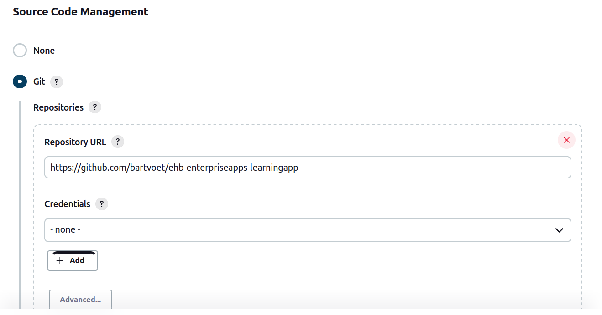
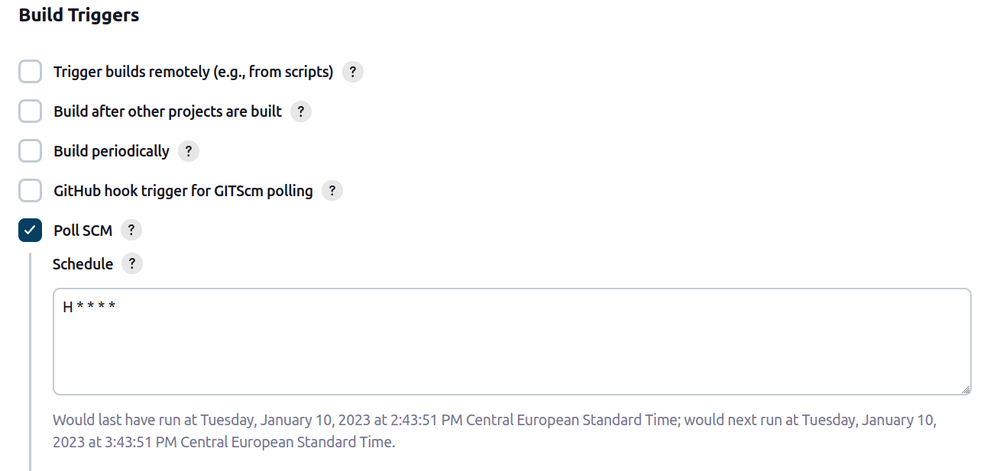
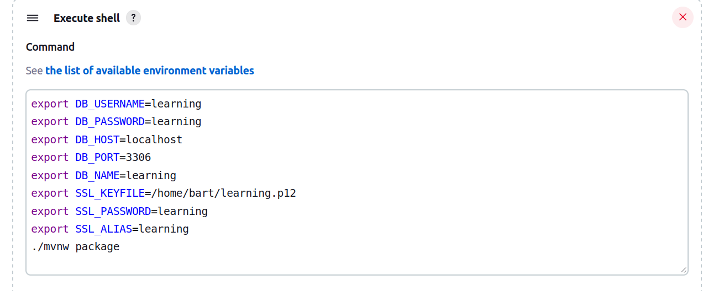
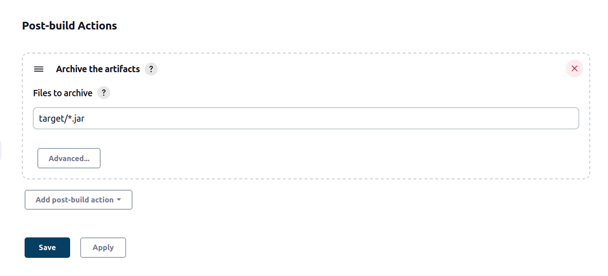
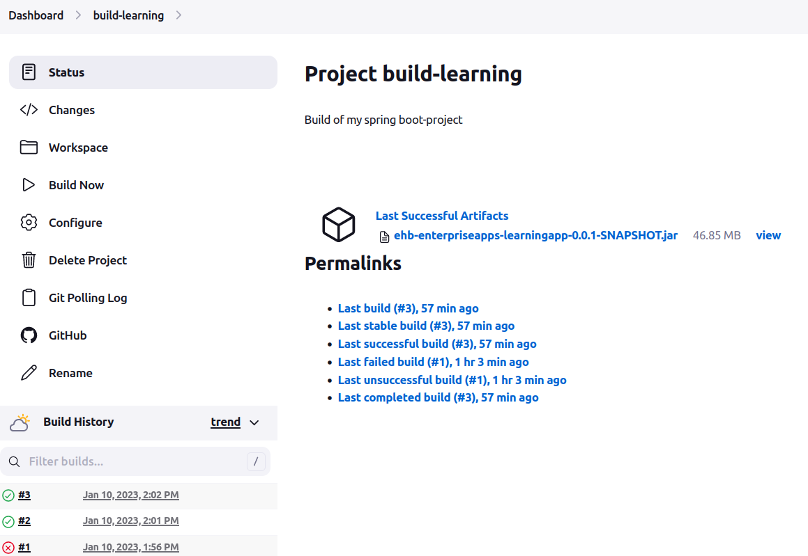
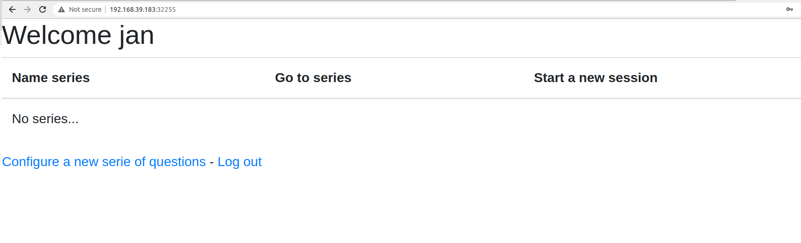

# Learning how to deploy a springboot/mysql-app in Kubernetes

## Into

In the context of the course **"Enterprise applications"** I needed to build an
application with the Spring Framework, more precisely in **Spring Boot** (serverless).

The application should be backed by a database.  
In the context of the project I've chosen MySQL.

In the **context** of **server & cloud** the aim is to:

* Containerise the application
* Run it on Kubernetes (bundled with MySQL)

### Development environment

I developped this on a (native) Linux (Mint) Laptop:

* Intellij had been used for development (and Visual Studio as extra support for documentation and YAML's).
* Minikube has been used to manage/test locally the kubernetes-deployments
* Jenkins is used as CI-tool in order to listen to git-changes
* XAMP is used for getting the database up

### Application

The source-code of the application is to be found at:

https://github.com/bartvoet/ehb-enterpriseapps-learningapp

The project is open, so you can clone the repo at:

~~~bash
$ git clone git@github.com:bartvoet/ehb-enterpriseapps-learningapp.git
~~~

> By the time of publishing the yaml and docker-files will be present in this repo

## Assignment 1: expose the application over HTTPS

One of the questions was that the appliciation needed to contain a secure login.  

I developped/configured for the necessary authentication and authorization-features
through Spring Security.

What was remaining is to expose the applciation only over HTTPS.  
Since Spring Boot (Tomcat) support jks and p12-formats I used the command documented hereunder
to generate a pks12-file:

~~~bash
$ keytool -genkeypair -alias learning -keyalg RSA -keysize 2048 -storetype PKCS12 -keystore learning.p12 -validity 3650
~~~

In order to force Spring Boot to (only) boot over HTTPS I needde to configure the following 
in the application-production.properties:

**application-production.properties** will only be loaded in case of 
the prodution-profile is loaded.  I configured for this a seperate
launcher in IntelliJ to test this.  
I
In case the environment-variable spring_profiles_active=production
is set this configuration will be activated.

The default behavior will be actually without https to not burden your
local development with it.

> The disadvantage of this approach is that you have explicitely activate
> this for production-deployments.

~~~properties
server.ssl.key-store-type=PKCS12
server.ssl.key-store=${SSL_KEYFILE}
server.ssl.key-store-password=${SSL_PASSWORD}
server.ssl.key-alias=${SSL_ALIAS}
server.ssl.enabled=true
~~~

The location and keystore-information is also to be passed on to the application
through environment-variables.  
I've chosen for this in order not to include the pks12-file in the code and to provide the 
location and name over https.

## Assignment 2: Configuring CI with Jenkins

### Installation of Jenkins

First I needed to install Jenkins for this.  
Jenkins was installed installed following the procedure described on their website:

~~~
$ curl -fsSL https://pkg.jenkins.io/debian-stable/jenkins.io.key | sudo tee \
  /usr/share/keyrings/jenkins-keyring.asc > /dev/null
echo deb [signed-by=/usr/share/keyrings/jenkins-keyring.asc] \
  https://pkg.jenkins.io/debian-stable binary/ | sudo tee \
  /etc/apt/sources.list.d/jenkins.list > /dev/null
$ sudo apt-get update
$ sudo apt-get install jenkins
~~~

### Build-job

A **Jenkins-job** for building the **learning-app** has been created **configured**.  
It's configured to **listen** to the **git-repository** (in case of commit the build will be triggered):

> *Note*  
> No **authentication** is not provided because the necessary ssh-keys
> had been configured into github

The build is **triggered** **automatically** by letting Jenkins listen to the remote repo

The following **build-script** was used for building the actual project.

~~~bash
export DB_USERNAME=learning
export DB_PASSWORD=learning
export DB_HOST=localhost
export DB_PORT=3306
export DB_NAME=learning
export SSL_KEYFILE=/home/bart/learning.p12
export SSL_PASSWORD=learning
export SSL_ALIAS=learning
./mvnw package 
~~~

At the end we **configured** the **export** of **artifact** so that it can be exposed 
for download or later reuse by other jobs...

> *Note:*  
> Goal was to reuse this in a docker-build but at the time of writing this was not yet
> configured.

### Build result

Once the jobs was triggered the result:

The latest release can now be downloaded at:

http://localhost:8080/job/build-learning/lastSuccessfulBuild/artifact/target/ehb-enterpriseapps-learningapp-0.0.1-SNAPSHOT.jar

### Disable locally

Since Jenkins is used **locally** I disabled the systemctl so that it doesn't start on reboot...  
(it's not a VM, it's my own Linux and Jenkins can be quite memory-intensive)

~~~bash
$ sudo systemctl disable jenkins
Synchronizing state of jenkins.service with SysV service script with /lib/systemd/systemd-sysv-install.
Executing: /lib/systemd/systemd-sysv-install disable jenkins
Removed /etc/systemd/system/multi-user.target.wants/jenkins.service.
$ sudo systemctl status jenkins
● jenkins.service - Jenkins Continuous Integration Server
     Loaded: loaded (/lib/systemd/system/jenkins.service; disabled; vendor preset: enabled)
     Active: active (running) since Tue 2023-01-10 13:41:03 CET; 1h 22min ago
   Main PID: 158823 (java)
      Tasks: 59 (limit: 38271)
     Memory: 1.3G
     CGroup: /system.slice/jenkins.service
             └─158823 /usr/bin/java -Djava.awt.headless=true -jar /usr/share/java/jenkins.war --webroot=/var/cache/jenkins/war --httpPort=8080

Jan 10 13:43:52 bvlegion jenkins[158823]: 2023-01-10 12:43:52.744+0000 [id=291]        INFO        jenkins.InitReactorRunner$1#onAttained: Listed all plugins
Jan 10 13:43:52 bvlegion jenkins[158823]: 2023-01-10 12:43:52.756+0000 [id=295]        INFO        jenkins.InitReactorRunner$1#onAttained: Prepared all plugins
Jan 10 13:43:52 bvlegion jenkins[158823]: 2023-01-10 12:43:52.762+0000 [id=285]        INFO        jenkins.InitReactorRunner$1#onAttained: Started all plugins
Jan 10 13:43:52 bvlegion jenkins[158823]: 2023-01-10 12:43:52.764+0000 [id=285]        INFO        jenkins.InitReactorRunner$1#onAttained: Augmented all extensions
Jan 10 13:43:52 bvlegion jenkins[158823]: 2023-01-10 12:43:52.770+0000 [id=287]        INFO        jenkins.InitReactorRunner$1#onAttained: System config loaded
Jan 10 13:43:52 bvlegion jenkins[158823]: 2023-01-10 12:43:52.771+0000 [id=287]        INFO        jenkins.InitReactorRunner$1#onAttained: System config adapted
Jan 10 13:43:52 bvlegion jenkins[158823]: 2023-01-10 12:43:52.778+0000 [id=292]        INFO        jenkins.InitReactorRunner$1#onAttained: Loaded all jobs
Jan 10 13:43:52 bvlegion jenkins[158823]: 2023-01-10 12:43:52.778+0000 [id=287]        INFO        jenkins.InitReactorRunner$1#onAttained: Configuration for all jobs updated
Jan 10 13:43:53 bvlegion jenkins[158823]: 2023-01-10 12:43:53.112+0000 [id=291]        INFO        jenkins.InitReactorRunner$1#onAttained: Completed initialization
Jan 10 13:43:53 bvlegion jenkins[158823]: 2023-01-10 12:43:53.113+0000 [id=95]        INFO        h.m.UpdateCenter$CompleteBatchJob#run: Completed installation of 88 plugins in 1 min 40 sec
(base) bart@bvlegion:~/school/ehb/projects/ehb-enterpriseapps-learningapp$ 
~~~

## Assignment 3: Containerizing the learning-application

### Spring Boot is serverless

**Spring Boot** is a **serverless** framework running an embedded Tomcat-server.  
If suffices to run the jar file to start the web-application

~~~bash
$ find -name "*jar"
./target/ehb-enterpriseapps-learningapp-0.0.1-SNAPSHOT.jar
$ java -jar ./target/ehb-enterpriseapps-learningapp-0.0.1-SNAPSHOT.jar
...
~~~

### Making the application environment-independent

But before to containerize the application (and to work with kubernetes) we needed
to remove all the hardware-dependent logic.  

The database-reference was still present in the application.properties as an hard-coded
value.

To change this I used the following environment-variables for the app:

* DB_USERNAME
* DB_PASSWORD
* DB_HOST
* DB_PORT
* DB_NAME

resulting in the following properties-file

~~~properties
spring.datasource.url=jdbc:mysql://${DB_HOST}:${DB_PORT}/${DB_NAME}?useSSL=false
spring.datasource.password=${DB_USERNAME}
spring.datasource.username=${DB_PASSWORD}
~~~

e.g. When running natively I need to run against following settings:

~~~bash
export DB_USERNAME=learning
export DB_PASSWORD=learning
export DB_HOST=localhost
export DB_PORT=3306
export DB_NAME=learning
export SSL_KEYFILE=/home/bart/learning.p12
export SSL_PASSWORD=learning
export SSL_ALIAS=learning
~~~

### Building the docker-file

The last step of the containerisation was to make a Dockerfile for this.  
I used the standard image used to run java-applications:

~~~Dockerfile
FROM openjdk:17-jdk-alpine
ARG JAR_FILE=target/*.jar
COPY ${JAR_FILE} app.jar
ENTRYPOINT ["java","-jar","/app.jar"]
~~~

Since the applciation is serverless (see first part of this document) it
suffices to pass on the jar-file which is in the target-folder (build-result).

> The application has been built with Java 17 so no lower version can be used

To build the image you can use the 2 following commands
(given that you're located in the root of the Spring Boot-app).

* First build the application through **Maven**

~~~bash
$ ./mvnw package
[INFO] Scanning for projects...
[INFO] 
[INFO] ---------< be.ehb.bvo.leanring:ehb-enterpriseapps-learningapp >---------
...
[INFO] Building jar: /home/bart/school/ehb/projects/ehb-enterpriseapps-learningapp/target/ehb-enterpriseapps-learningapp-0.0.1-SNAPSHOT.jar
...
[INFO] ------------------------------------------------------------------------
[INFO] BUILD SUCCESS
[INFO] ------------------------------------------------------------------------
[INFO] Total time:  2.333 s
[INFO] Finished at: 2023-01-10T10:51:22+01:00
[INFO] ------------------------------------------------------------------------
~~~

* Secondly build the **docker-image**

~~~bash
$ docker build -t bvspring/spring-boot-learning-docker .
~~~

> *Note:*  
> The docker-image was built without root-permission.  
> This will be explained in the minikube-part

After deployment the image is available for reuse (next to other packages):

~~~bash
$ sudo docker images
[sudo] password for bart:         
REPOSITORY                             TAG             IMAGE ID       CREATED         SIZE
bvspring/spring-boot-learning-docker   latest          142c577f959a   4 hours ago     375MB
springboot-learning                    1.0             142c577f959a   4 hours ago     375MB
<none>                                 <none>          0b6590ed2e68   6 hours ago     375MB
influxdb                               latest          df1c226db87e   3 weeks ago     376MB
grafana/grafana                        latest          83f377cc32a0   3 weeks ago     317MB
telegraf                               latest          7376e8255c84   4 weeks ago     375MB
eclipse-mosquitto                      latest          09ef04ba0be0   8 weeks ago     11.9MB
gcr.io/k8s-minikube/kicbase            v0.0.36         866c1fe4e3f2   2 months ago    1.11GB
influxdb                               1.8-alpine      8a20ca475f19   3 months ago    163MB
openjdk                                17-jdk-alpine   264c9bdce361   18 months ago   326MB
$ 
~~~

### Environment-variables for minikube

In order to make this run available for minukube (running under my user) I needed to 
align the docker env-variables with those from minikube (before previous command)

~~~bash
$ eval $(minikube -p minikube docker-env)
~~~

## Assignment 4: Preparing kubernetes (Minikube & kubectl)

In order to **run** the application within **Kubernetes** I installed **Minikube** to 
run with my local development-environment.

### Installing Minikube

For this I used the instructions as provided on the website (for Debian- or Ubuntu-derivates)

~~~bash
$ curl -LO https://storage.googleapis.com/minikube/releases/latest/minikube_latest_amd64.deb
$ sudo dpkg -i minikube_latest_amd64.deb
~~~

### Running Minikube

Starting minkube can be done through:

~~~bash
$ minikube start
~~~

#### Troubleshooting 1: exposing Minikube-environment-variables

The first tryout with a Spring Boot application was not successfull.  
The following command needed to be combined to be able to access my home-built image(s)

~~~bash
$ eval $(minikube -p minikube docker-env)
~~~

This command ensures that in your current shell the correct **environment-variables**
are loaded to point to the kubernetes-envonment.

~~~bash
$ minikube -p minikube docker-env
export DOCKER_TLS_VERIFY="1"
export DOCKER_HOST="tcp://192.168.39.183:2376"
export DOCKER_CERT_PATH="/home/bart/.minikube/certs"
export MINIKUBE_ACTIVE_DOCKERD="minikube"

# To point your shell to minikube's docker-daemon, run:
# eval $(minikube -p minikube docker-env)
~~~

As you see this command points docker to the right Docker-host.  
If you don't to this you will have permission problems as minikube
runs under your own user.

#### Troubleshooting 2:  using kubectl through minikube

When installing on **Linux** Mint **kubectl** was **not** **provided**
as an executiable.  
It can be however accessed through the minikube-command.  
e.g. to run...

~~~bash
kubectl -- get all
~~~

...I needed to invoke this trough

~~~bash
minikube kubectl -- get all
~~~

The most common solution in this case is to create an alias kubectl.  

~~~bash
alias kubectl="minikube kubectl --"
~~~

As a consequence I added this **alias** to my **.bashrc**

> *Note:*  
> The following examples didn't use this alias...
> since time was not on my side 

## Assignment 5: Deployment of MySQL to Minikube

Before running the application a running instance of **MySQL** needed to be loaded
and tested.

### Creation deployment-file

Since the application must be deployed together with MySQL I created a YAML-file
with following content:

* Mounting the volume at **/var/lib/learningmysql**
* Exposing MySQL through **3306** (default port)
* Reserving **1 GB** for storage (should be enough for a small app)

~~~yaml
# Define a 'Service' To Expose MySQL to Other Services
apiVersion: v1
kind: Service
metadata:
  name: mysql
  labels:
    app: mysql
    tier: database
spec:
  ports:
    - port: 3307
      targetPort: 3307
  selector:
    app: mysqmySQL Pod Should contain same l
    tier: database
  clusterIP: None # DNS is used, so clusterIP is not needed

---
# 'Persistent Volume Claim'(PVC) for MySQL Storage
apiVersion: v1
kind: PersistentVolumeClaim
metadata:
  name: mysql-pv-claim
  labels:
    app: mysql
    tier: database
spec:
  accessModes:
    - ReadWriteOnce
  resources:
    requests:
      storage: 1Gi

---
# Deployment specification
apiVersion: apps/v1
kind: Deployment
metadata:
  name: mysql
  labels:
    app: mysql
    tier: database
spec:
  selector: # labels
    matchLabels:
      app: mysql
  strategy:
    type: Recreate
  template:
    metadata:
      labels: # Must match 'Service' and 'Deployment' selectors
        app: mysql
        tier: database
    spec:
      containers:
        - name: mysql
          image: mysql
          imagePullPolicy: "IfNotPresent"
          env:
            - name: MYSQL_ROOT_PASSWORD
              value: root
            - name: MYSQL_DATABASE
              value: learning
          ports:
            - containerPort: 3307
              name: mysql
          volumeMounts:
            - mountPath: /var/lib/learningmysql
              name: mysql-persistance-storage
      volumes:
        - name: mysql-persistance-storage
          persistentVolumeClaim:
            claimName: mysql-pv-claim
~~~

### Applying the mysql

In order to apply this through the following command.

~~~bash
$ minikube kubectl -- apply -f mysql-deployment.yaml
    > kubectl.sha256:  64 B / 64 B [-------------------------] 100.00% ? p/s 0s
    > kubectl:  42.93 MiB / 42.93 MiB [-----------] 100.00% 64.48 MiB p/s 900ms
service/mysql created
persistentvolumeclaim/mysql-pv-claim created
deployment.apps/mysql created
$ 
~~~

Following on this command I've checked through the **get pods** that it was **active**

~~~bash
$ minikube kubectl -- get pods
NAME                     READY   STATUS    RESTARTS   AGE
mysql-6478956664-kqwbv   1/1     Running   0          2m16s
$ 
~~~

### Accessing and testing the mysql-database

To test and go to MySQL I accessed the applciation through the pod-name

~~~bash
$ minikube kubectl -- exec -it mysql-6478956664-kqwbv bash
kubectl exec [POD] [COMMAND] is DEPRECATED and will be removed in a future version. Use kubectl exec [POD] -- [COMMAND] instead.
bash-4.4# 
~~~

I accessed the appcliation throught the root-password (as present in the YAML)

> *Note*  
> Putting the root-password in the deployment-file is not considered a good practice
> and should be managed through secrets.  
> Due to time-constraints I was however not able to implement this on time.  
> This is however on the planning.

~~~bash
bash-4.4# mysql -h mysql -u root -p
Enter password: 
Welcome to the MySQL monitor.  Commands end with ; or \g.
Your MySQL connection id is 8
Server version: 8.0.31 MySQL Community Server - GPL

Copyright (c) 2000, 2022, Oracle and/or its affiliates.

Oracle is a registered trademark of Oracle Corporation and/or its
affiliates. Other names may be trademarks of their respective
owners.

Type 'help;' or '\h' for help. Type '\c' to clear the current input statement.

mysql> 
~~~

The database defined in the deployment-file had been created:

~~~
mysql> show schemas;
+--------------------+
| Database           |
+--------------------+
| information_schema |
| learning           |
| mysql              |
| performance_schema |
| sys                |
+--------------------+
5 rows in set (0.00 sec)

mysql> 
~~~

I was able to go to the schema... 

~~~bash
mysql> use learning;
mysql> show tables;
Empty set (0.01 sec)
~~~

And created a table

~~~bash
mysql> 
mysql> create table test(id integer auto_increment primary key, name varchar(30));
Query OK, 0 rows affected (0.06 sec)

mysql> show tables;
+--------------------+
| Tables_in_learning |
+--------------------+
| test               |
+--------------------+
1 row in set (0.00 sec)
~~~

And inserted some data:

~~~
mysql> insert into test(name) values('Bart Voet');
Query OK, 1 row affected (0.03 sec)

mysql> select * from test;
+----+-----------+
| id | name      |
+----+-----------+
|  1 | Bart Voet |
+----+-----------+
1 row in set (0.00 sec)
mysql>
~~~

Exit

~~~
mysql> quit
Bye
bash-4.4# exit
$
~~~

## Assignment 6: Deploy and test Spring Boot

The last step of the development was to deploy the Spring Boot
application and connect it to the database

### Build docker-image

First the application.

~~~bash
$ ./mvnw package
[INFO] Scanning for projects...
...
[INFO] ------------------------------------------------------------------------
[INFO] BUILD SUCCESS
[INFO] ------------------------------------------------------------------------
[INFO] Total time:  2.333 s
[INFO] Finished at: 2023-01-10T10:51:22+01:00
[INFO] ------------------------------------------------------------------------
(base) bart@bvlegion:~/school/ehb/projects/ehb-enterpriseapps-learningapp$ 
~~~

After that the dockerfile

~~~
$ docker build -t springboot-learning:1.0 .
Sending build context to Docker daemon  50.52MB
Step 1/4 : FROM openjdk:17-jdk-alpine
17-jdk-alpine: Pulling from library/openjdk
5843afab3874: Pull complete 
53c9466125e4: Pull complete 
d8d715783b80: Pull complete 
Digest: sha256:4b6abae565492dbe9e7a894137c966a7485154238902f2f25e9dbd9784383d81
Status: Downloaded newer image for openjdk:17-jdk-alpine
 ---> 264c9bdce361
Step 2/4 : ARG JAR_FILE=target/*.jar
 ---> Running in 4344d95ca068
Removing intermediate container 4344d95ca068
 ---> 437b8f4a9ae1
Step 3/4 : COPY ${JAR_FILE} app.jar
 ---> 41504ff3b848
Step 4/4 : ENTRYPOINT ["java","-jar","/app.jar"]
 ---> Running in 9a0c54f424c9
Removing intermediate container 9a0c54f424c9
 ---> 9adee59fa831
Successfully built 9adee59fa831
Successfully tagged springboot-learning:1.0
$
~~~

### Deployment-file for Spring Boot

I based myself on the standard example for deploying a Java-applciation
in Kubernetes with attention to:

* Setting the replicas to 1  
  Most examples use more then 1 but in this context it's not required
* Adding the necessary "Environmental Variables" used by the Spring Application
* Configuring the 8081-port (Jenkins) as I use that for local development outside
  Kubernetes (to avoid conflict with Jenkins).  

~~~yaml
---
apiVersion: apps/v1
kind: Deployment
metadata:
  name: springboot-learning
spec:
  selector:
    matchLabels:
      app: springboot-learning
  replicas: 1
  template:
    metadata:
      labels:
        app: springboot-learning
    spec:
      containers:
        - name: springboot-learning
          image: springboot-learning:1.0
          imagePullPolicy: Never
          ports:
            - containerPort: 8081
          env:   # Setting Environmental Variables
            - name: DB_HOST   # Setting Database host address
              value: mysql
            - name: DB_NAME  # Setting Database name
              value: learning
            - name: DB_USERNAME  # Setting Database username
              value: root
            - name: DB_PASSWORD # Setting Database password
              value: root
            - name: DB_PORT # Setting Database password
              value: "3307"

# This seperator --- below is MANDATORY!!!
---
# Define a 'Service' To Expose the application
apiVersion: v1
kind: Service
metadata:
  name: learning-service
spec:
  ports:
    - protocol: "TCP"
      port: 8081    # Port inside the cluster
      targetPort: 8081   # Port exposed to the outside
  selector:
    app: springboot-learning
  type: NodePort
~~~

### First try...

I applied this deployment-file through the follwoing command

~~~
$ minikube kubectl -- apply -f app-deployment.yaml
deployment.apps/learning-v2 created
service/learning-service created
$ 
~~~

When chekcing the pods however I discovered the following status:

~~~
$ minikube kubectl -- get pods
NAME                           READY   STATUS             RESTARTS   AGE
learning-v2-6d7447d5cb-n7pl2   0/1     ImagePullBackOff   0          44s
learning-v2-6d7447d5cb-pzptn   0/1     ErrImagePull       0          44s
learning-v2-6d7447d5cb-sssp4   0/1     ErrImagePull       0          44s
$
~~~

The status **ImagePullBackOff** indicated a permission-problem

### Solution first try

Solution was to use the command documented in the minikube-part

~~~bash
$ eval $(minikube -p minikube docker-env)
~~~

And I needed to rebuild the Dockerfile so that I was available 
for Minikube

~~~bash
$ docker build -t springboot-learning:1.0 .
~~~

And I redeployed the pod:

~~~bash
$ minikube kubectl -- delete -f app-deployment.yaml
deployment.apps "springboot-learning" deleted
service "learning-service" deleted
$ minikube kubectl -- create -f app-deployment.yaml
~~~

### Second try...

After this it seemed to be working

~~~bash
$ minikube ip
192.168.39.183
$ minikube kubectl -- get service
NAME               TYPE        CLUSTER-IP      EXTERNAL-IP   PORT(S)          AGE
kubernetes         ClusterIP   10.96.0.1       <none>        443/TCP          158m
learning-service   NodePort    10.108.56.149   <none>        8080:31832/TCP   2m23s
mysql              ClusterIP   None            <none>        3307/TCP         66m
~~~

I tried to access through the following url (as indicated by the above output)

http://192.168.39.183:31832/

But it was not yet working

### Troubleshooting 2

Lookig at the status I discovered that the status was CrashLoopBackOff.  

~~~bash
 minikube kubectl -- get all                                                                                                                                        
NAME                                      READY   STATUS             RESTARTS         AGE                                                                                                                                                     
pod/mysql-9ccd74574-f4r4n                 1/1     Running            0                26s                                                                                                                                                     
pod/springboot-learning-7fb747d47-8xzb2   0/1     Error              13 (5m45s ago)   43m                                                                                                                                                     
pod/springboot-learning-7fb747d47-9hs4r   0/1     CrashLoopBackOff   13 (55s ago)     44m                                                                                                                                                     
pod/springboot-learning-7fb747d47-wb7vc   0/1     CrashLoopBackOff   14 (2m50s ago)   51m                                                                                                                                                     
                                                                                                                                                                                                                                              
NAME                       TYPE        CLUSTER-IP     EXTERNAL-IP   PORT(S)          AGE                                                                                                                                                      
service/kubernetes         ClusterIP   10.96.0.1      <none>        443/TCP          4h34m                                                                                                                                                    
service/learning-service   NodePort    10.96.191.87   <none>        8080:31023/TCP   51m                                                                                                                                                      
service/mysql              ClusterIP   None           <none>        3307/TCP         27s                                                                                                                                                      
                                                                                                                                                                                                                                              
NAME                                  READY   UP-TO-DATE   AVAILABLE   AGE                                                                                                                                                                    
deployment.apps/mysql                 1/1     1            1           27s                                                                                                                                                                    
deployment.apps/springboot-learning   0/3     3            0           51m                                                                                                                                                                    
                                                                                                                                                                                                                                              
NAME                                            DESIRED   CURRENT   READY   AGE                                                                                                                                                               
replicaset.apps/mysql-9ccd74574                 1         1         1       27s                                                                                                                                                               
replicaset.apps/springboot-learning-7fb747d47   3         3         0       51m     
~~~

Looking at applciation-logs there was a problem with the java-pp connecting to 
the MySQL.

The problem was however not linked to the connectivity (the server could reached)
but had 2 problems:

* Using port 3307 that I used originally couldn't be handled
* A problem occurred with the exchange of the Public Keys

~~~
$ minikube kubectl -- logs springboot-learning-5886bd6fbc-57qs7 springboot-learning                                  
                                                                                                                                                                                              
  .   ____          _            __ _ _                                                                                                                                                       
 /\\ / ___'_ __ _ _(_)_ __  __ _ \ \ \ \                                                                                                                                                      
( ( )\___ | '_ | '_| | '_ \/ _` | \ \ \ \                                                                                                                                                     
 \\/  ___)| |_)| | | | | || (_| |  ) ) ) )                                                                                                                                                    
  '  |____| .__|_| |_|_| |_\__, | / / / /                                                                                                                                                     
 =========|_|==============|___/=/_/_/_/                                                                                                                                                      
 :: Spring Boot ::                (v3.0.0)                                                                                                                                                    
                                                                                                                                                                                              
2023-01-10T10:50:07.600Z  INFO 1 --- [           main] .EhbEnterpriseappsLearningappApplication : Starting EhbEnterpriseappsLearningappApplication v0.0.1-SNAPSHOT using Java 17-ea with PID 1
 (/app.jar started by root in /)                                                                                                                                                              
2023-01-10T10:50:07.608Z  INFO 1 --- [           main] .EhbEnterpriseappsLearningappApplication : No active profile set, falling back to 1 default profile: "default"                         
2023-01-10T10:50:08.805Z  INFO 1 --- [           main] .s.d.r.c.RepositoryConfigurationDelegate : Bootstrapping Spring Data JPA repositories in DEFAULT mode.                                 
2023-01-10T10:50:08.938Z  INFO 1 --- [           main] .s.d.r.c.RepositoryConfigurationDelegate : Finished Spring Data repository scanning in 123 ms. Found 4 JPA repository interfaces.

2023-01-10T10:50:12.615Z ERROR 1 --- [           main] com.zaxxer.hikari.pool.HikariPool        : HikariPool-1 - Exception during pool initialization.                                        
                                                                                                                                                                                              
java.sql.SQLNonTransientConnectionException: Cannot load connection class because of underlying exception: com.mysql.cj.exceptions.WrongArgumentException: Failed to parse the host:port pair 
'mysql:${DB_PORT}'.                                                                                                                                                                           
        at com.mysql.cj.jdbc.exceptions.SQLError.createSQLException(SQLError.java:110) ~[mysql-connector-j-8.0.31.jar!/:8.0.31]                                                               
        at com.mysq
~~~

### Solution

For this I needed to change the connection-string in the Spring Boot-application from

~~~properties
spring.datasource.url=jdbc:mysql://${DB_HOST}/${DB_NAME}
~~~

to 

~~~properties
spring.datasource.url=jdbc:mysql://${DB_HOST}/${DB_NAME}?useSSL=false&allowPublicKeyRetrieval=true
~~~

### Third time right...

After redeployment I ended up with a runing application

~~~
$ kubectl get all
NAME                                       READY   STATUS    RESTARTS   AGE
pod/mysql-549957797f-2m8qq                 1/1     Running   0          156m
pod/springboot-learning-7f6c57744d-kdgq9   1/1     Running   0          156m

NAME                       TYPE        CLUSTER-IP     EXTERNAL-IP   PORT(S)          AGE
service/kubernetes         ClusterIP   10.96.0.1      <none>        443/TCP          13h
service/learning-service   NodePort    10.102.40.60   <none>        8081:32255/TCP   156m
service/mysql              ClusterIP   None           <none>        3306/TCP         156m

NAME                                  READY   UP-TO-DATE   AVAILABLE   AGE
deployment.apps/mysql                 1/1     1            1           156m
deployment.apps/springboot-learning   1/1     1            1           156m

NAME                                             DESIRED   CURRENT   READY   AGE
replicaset.apps/mysql-549957797f                 1         1         1       156m
replicaset.apps/springboot-learning-7f6c57744d   1         1         1       156m
$ 
~~~

Which was accessible

## Assignement 6: backup

At the end I configured a crontab to ensure backup of my volume

~~~bash
$ crontab -l
# Edit this file to introduce tasks to be run by cron.
# 
# Each task to run has to be defined through a single line
# indicating with different fields when the task will be run
# and what command to run for the task
# 
# To define the time you can provide concrete values for
# minute (m), hour (h), day of month (dom), month (mon),
# and day of week (dow) or use '*' in these fields (for 'any').
# 
# Notice that tasks will be started based on the cron's system
# daemon's notion of time and timezones.
# 
# Output of the crontab jobs (including errors) is sent through
# email to the user the crontab file belongs to (unless redirected).
# 
# For example, you can run a backup of all your user accounts
# at 5 a.m every week with:
# 0 5 * * 1 tar -zcf /var/backups/home.tgz /home/
# 
# For more information see the manual pages of crontab(5) and cron(8)
# 
# m h  dom mon dow   command

* 23* * * *	cp -rf /home/bart/learningmysql /home/bart/learningmysql_bk
$
~~~ 
